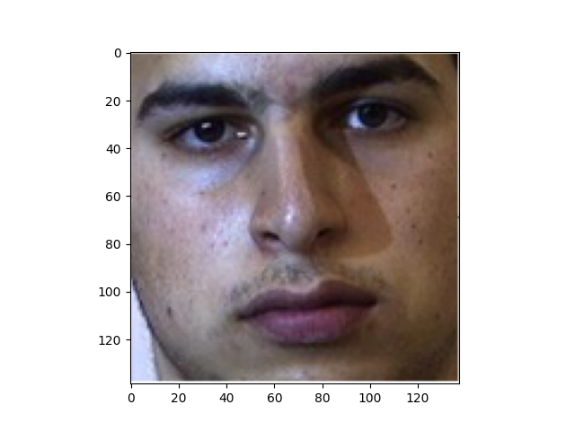
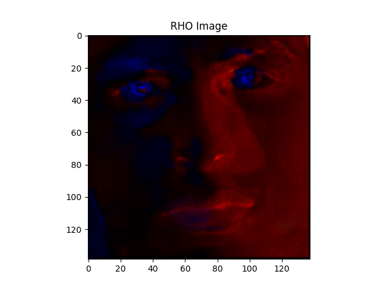
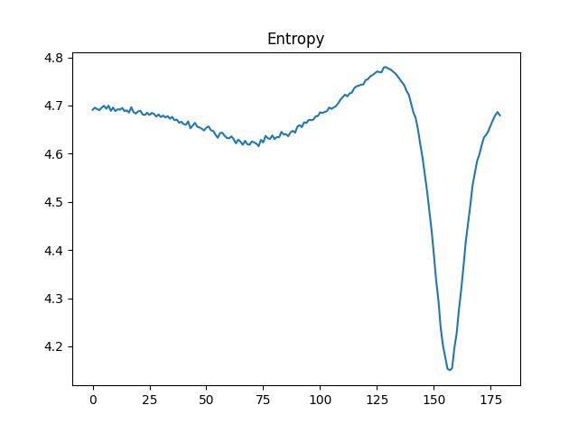
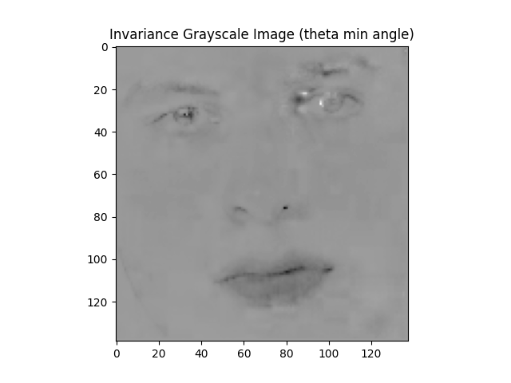
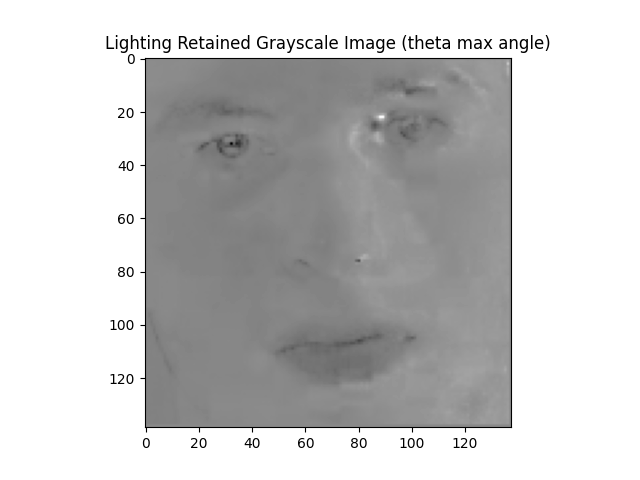
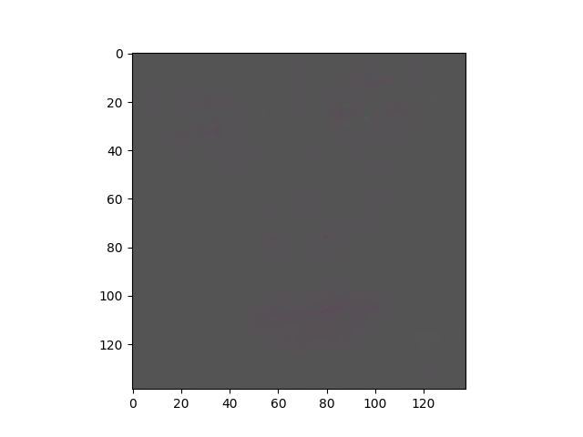
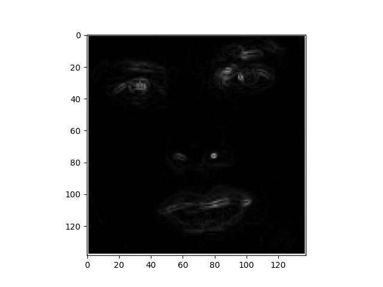
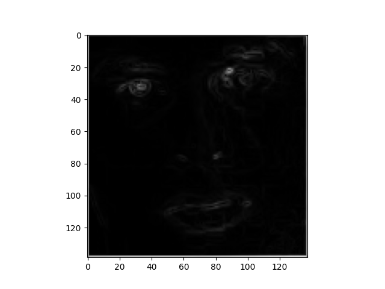
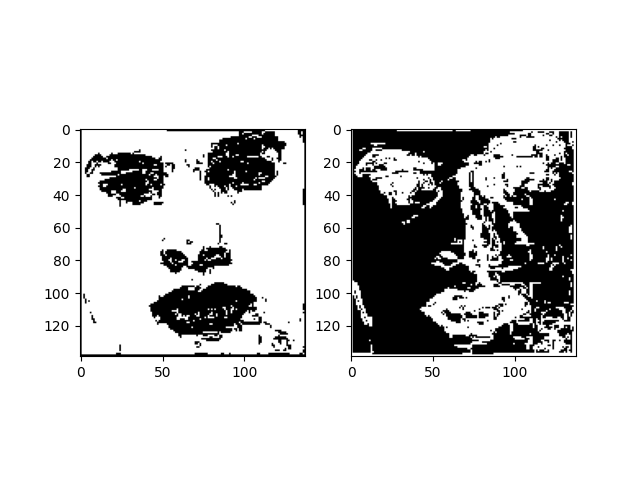
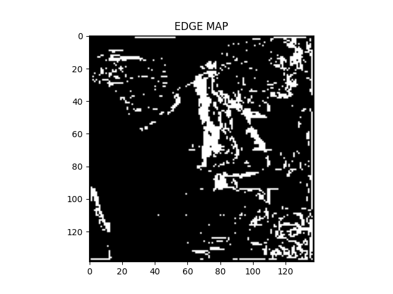

# Robust_Face_Recognition

## Experimental Results

Original Image | RHO Image | Entropy Minimalization | Min Theta Image | Max Theta Image | Invariant RG Chromaticity | Phi Min Image | Phi Max Image | Masked Images | Edge Map 
--- | --- | --- | --- |--- |--- |--- |--- |--- |---
 |  |  |  |  |  |  |  |  | 