# Robust_Face_Recognition

## Experimental Results

Results | Sample 1 | Sample 3
--- | --- | --- |
Original Image | 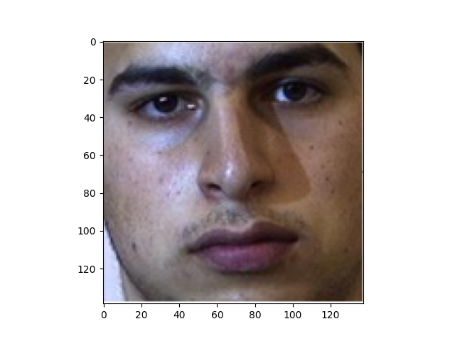 | 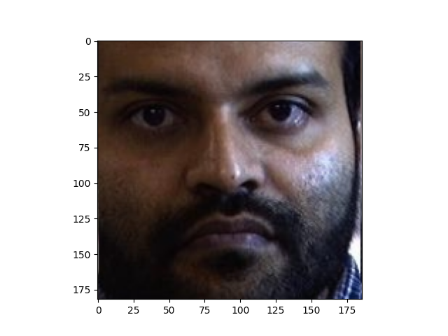
RHO Image | 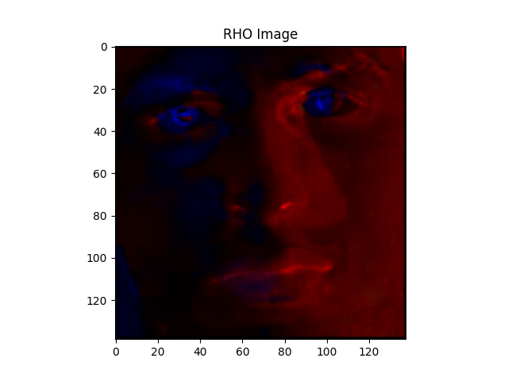 | 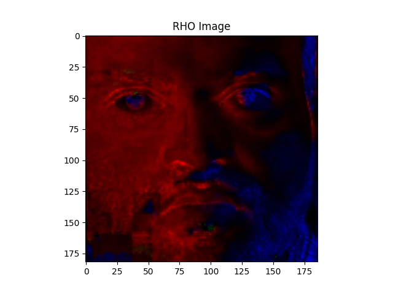
Entropy Minimalization | 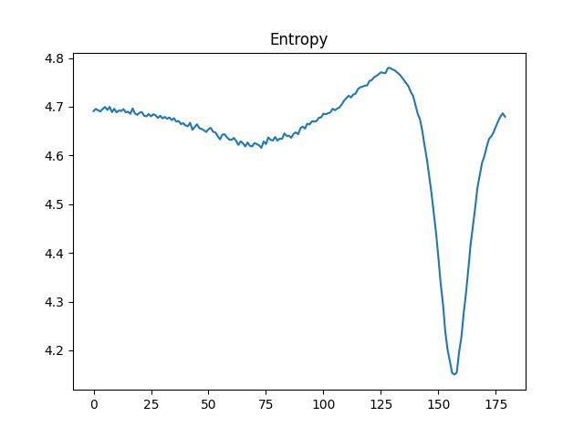 | 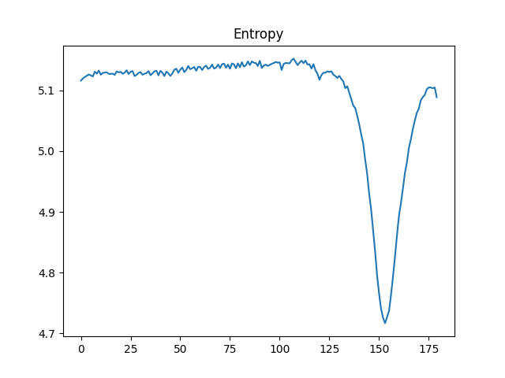
Min Theta Image | 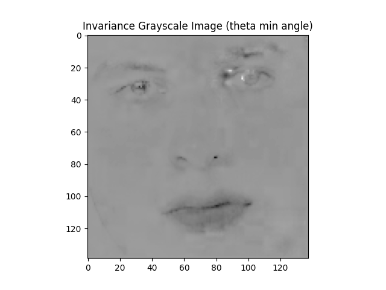 | 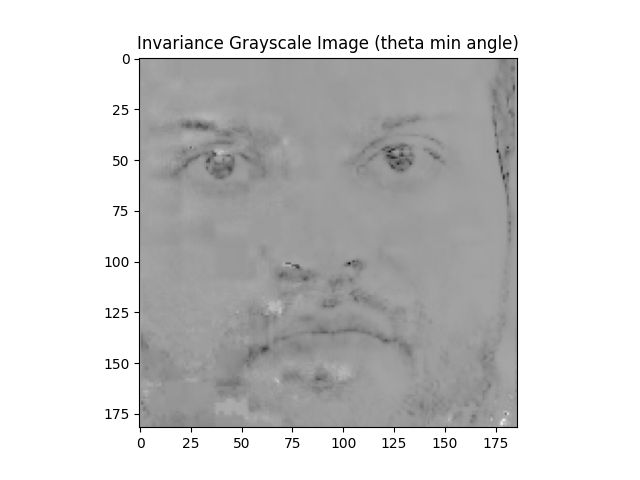
Max Theta Image |  | 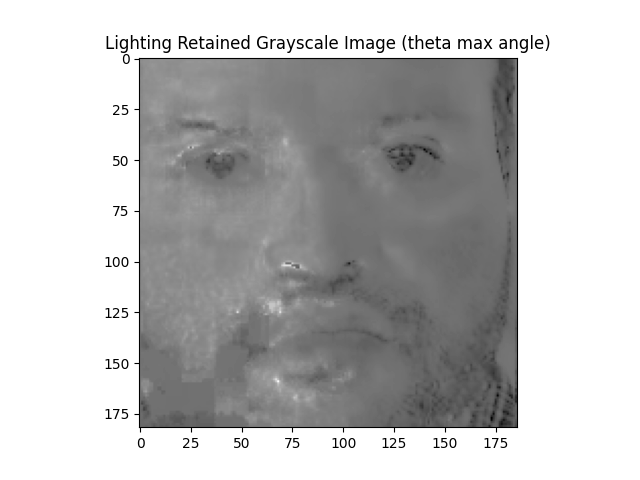
Invariant RG Chromaticity Image | 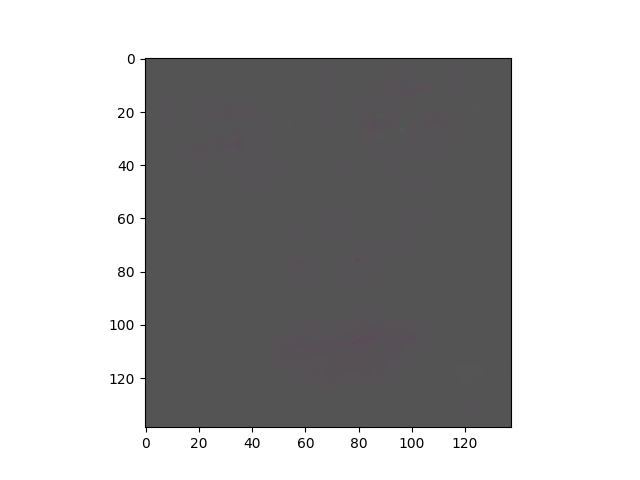 | 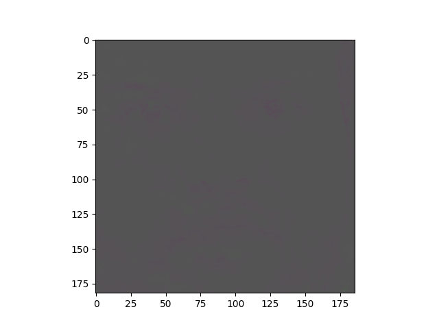
Phi Min Image | 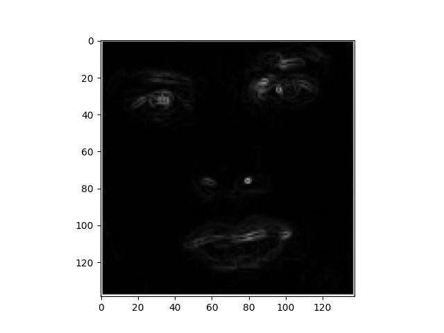 | 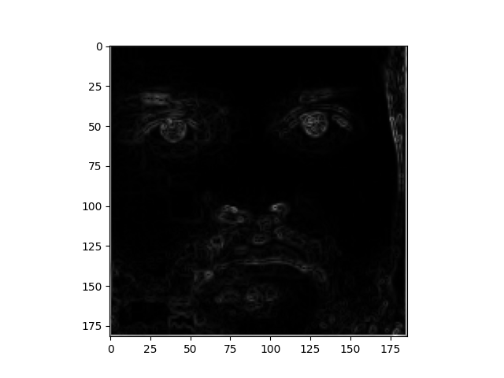
Phi Max Image | 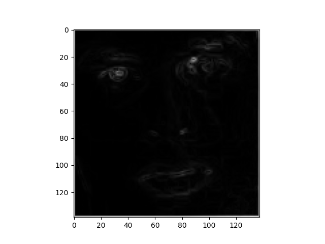 | 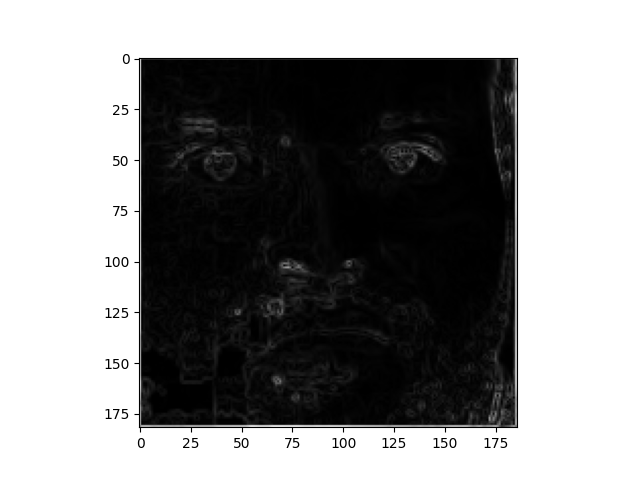
Masked Images | 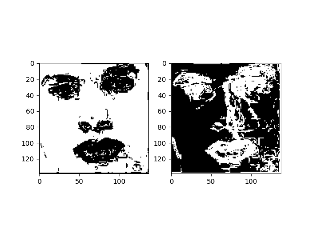 | 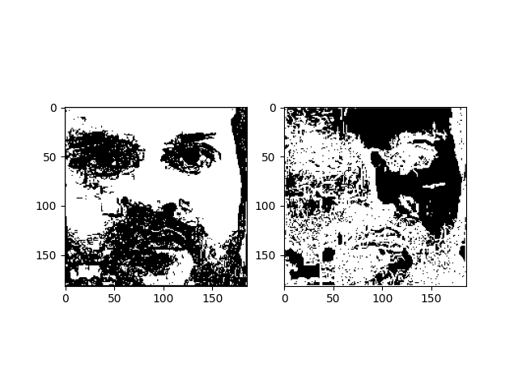
Edge Map | 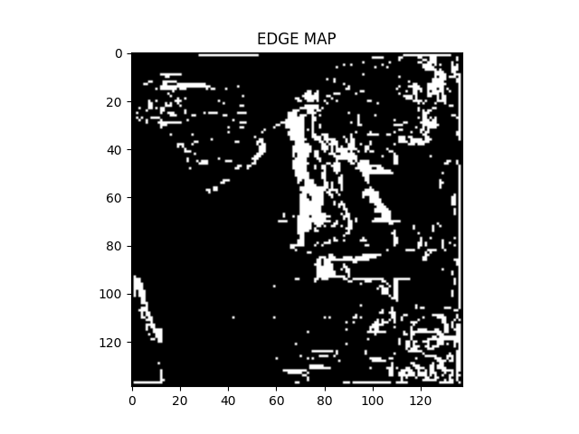 | 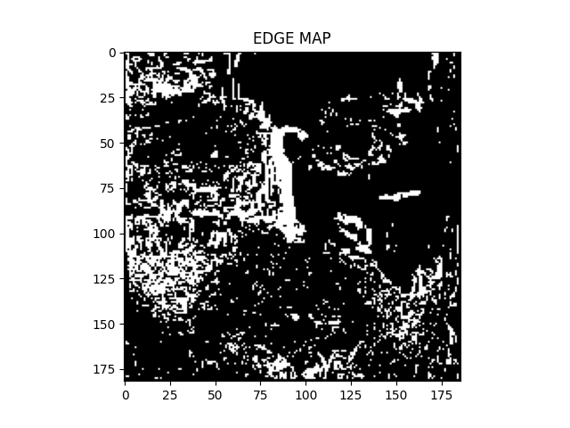

## Reference Links
